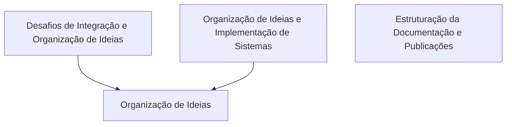
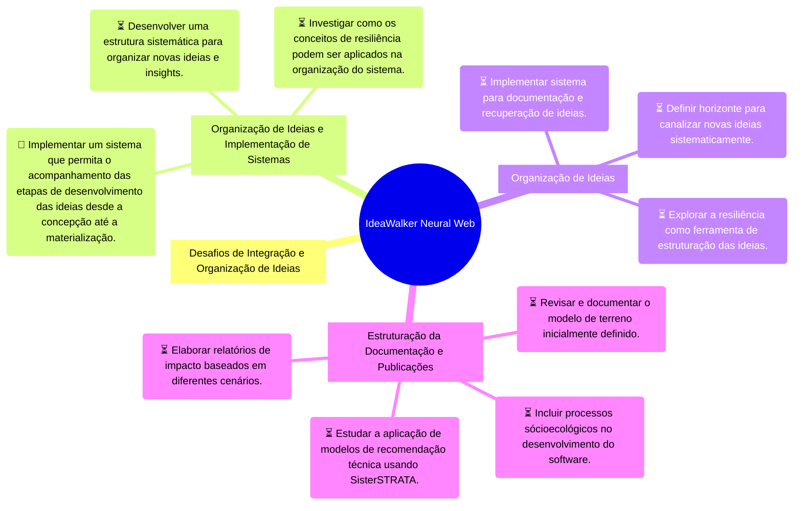

# IdeaWalker - Knowledge Base Export
Data: Jan  6 2026

## 🕸️ Neural Web (Mermaid Flowchart)



## 🧠 Mind Map (Tasks & Ideas)

# IdeaWalker Neural Web - Export




## 📝 Document Contents

### Desafios de Integração e Organização de Ideias
ID: `Nota_1767645289.md`

```markdown
# Título: Desafios de Integração e Organização de Ideias

## Insight Central
A dificuldade em conectar e integrar diversas ideias em um sistema organizado está causando preocupação, principalmente no contexto da implementação do modelo de terreno, vegetação e solo. O processo de transformar essas ideias em algo concreto é complicado, mas a interação com a IA tem sido útil na extravasão dessas ideias.

## Pontos Principais
1. **Integração de Ideias:** Enxerga as conexões entre as ideias mas enfrenta dificuldade no detalhamento e organização delas.
2. **Novas Ideias Constantes:** Novas ideias surgem frequentemente, como a implementação do modelo de terreno e vegetação.
3. **Sistematização das Ideias:** A necessidade de documentar e sistematizar as ideias nas fases iniciais para um ganho de produtividade é sentida.
4. **Resiliência e Abstração:** O conceito de resiliência como uma quarta dimensão ajuda na abordagem das dificuldades, mas a transformação concreta dessas ideias ainda é um desafio.

## Ações
1. **Documentação Sistemaática:** Buscar formas de documentar e organizar as ideias sistematicamente.
2. **Implementação do Modelos:** Avançar com o modelo de terreno, vegetação e solo, considerando a resiliência como um elemento essencial na concepção.
3. **Utilização da IA:** Continuar a interação com a IA para extravasar ideias e organizar-as.

## Conexões
1. **Interdisciplinaridade:** A integração de diferentes áreas (terreno, vegetação, solo) requer uma abordagem holística que considera o impacto de cada elemento no outro.
2. **Produtividade:** O uso da IA como um auxiliar na organização e documentação pode ser crucial para manter a produtividade e evitar a perda das ideias.
3. **Concretização:** A resiliência é vista como uma chave para dar concreto às ideias, permitindo avanços sustentáveis sem crises de inspiração ou perda de tempo.
```

Este estruturação em Markdown facilita a leitura e compreensão do pensamento original, organizando-o em seções claras que refletem os principais pontos discutidos.

---

### Organização de Ideias e Implementação de Sistemas
ID: `Nota_1767646148.md`

# Título: Organização de Ideias e Implementação de Sistemas

## Insight Central
A dificuldade em conectar e organizar várias ideias em mente e na implementação de sistemas como terreno, vegetação e análise vetorial. A necessidade de um sistema ou forma organizacional para canalizar essas ideias sistematicamente.

## Pontos Principais
- Dificuldade em integrar diferentes elementos do sistema.
- Necessidade de estruturação para organizar ideias surgidas ao longo do tempo.
- Interesse em utilizar conceitos como resiliência na organização e implementação de ideias.
- Busca por um processo que permita a finalização completa das ideias.

## Ações
- [ ] Desenvolver uma estrutura sistemática para organizar novas ideias e insights.
- [ ] Investigar como os conceitos de resiliência podem ser aplicados na organização do sistema.
- [/] Implementar um sistema que permita o acompanhamento das etapas de desenvolvimento das ideias desde a concepção até a materialização.

## Conexões
- [[Sistema de Organização de Ideias]]
- [[Conceitos de Resiliência]]


---

### Organização de Ideias
ID: `Nota_260106_0419_transcricao.md`

# Título: Organização de Ideias

## Insight Central
(Resumo em 1 parágrafo)

Estou enfrentando dificuldades para conectar e organizar ideias complexas, especialmente no contexto da integração de sistemas como terreno, vegetação e solo. Há um fluxo constante de novas ideias que emergem, mas sinto necessidade de uma estrutura efetiva para documentar e recuperar estas ideias ao longo do tempo.

## Pontos Principais
- Dificuldade em conectar e organizar ideias complexas.
- Necessidade de implementar sistemas como análise de patch e vetores.
- Importância da resiliência como quarta dimensão.
- Interesse na concepção completa das ideias, do início ao fim.

## Ações
- [ ] Implementar sistema para documentação e recuperação de ideias.
- [ ] Definir horizonte para canalizar novas ideias sistematicamente.
- [ ] Explorar a resiliência como ferramenta de estruturação das ideias.

## Conexões
- [[Integração de Sistemas]]
- [[Análise Vetorial]]

---

### Estruturação da Documentação e Publicações
ID: `Nota_260106_2029_transcricao.md`

# Título: Estruturação da Documentação e Publicações

## Insight Central
A documentação e publicação dos modelos, lógicas e conceitos desenvolvidos para o SisterSTRATA e outros componentes do projeto de ecologia computacional estão em andamento. É importante definir claramente os passos subsequentes para a implementação dessas ideias, como a matriz inicial e as transformações que ela pode sofrer com base em diferentes cenários sócioecológicos.

## Pontos Principais
- Publicar documentação científica sobre modelos e lógicas utilizadas.
- Definir o ponto de partida do modelo de terreno e sua evolução.
- Incorporar aspectos sócioecológicos e mudanças climáticas na análise.
- Considerar a resiliência como um parâmetro adicional na tomada de decisão.

## Ações
- [ ] Revisar e documentar o modelo de terreno inicialmente definido.
- [ ] Incluir processos sócioecológicos no desenvolvimento do software.
- [ ] Estudar a aplicação de modelos de recomendação técnica usando SisterSTRATA.
- [ ] Elaborar relatórios de impacto baseados em diferentes cenários.

## Conexões
- [[Modelagem Sócioecológica]]
- [[Resiliência Climática]]

---


